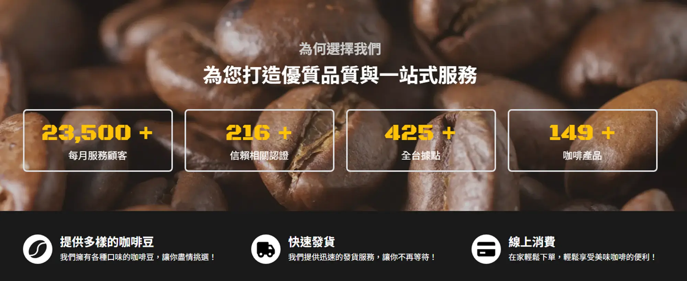
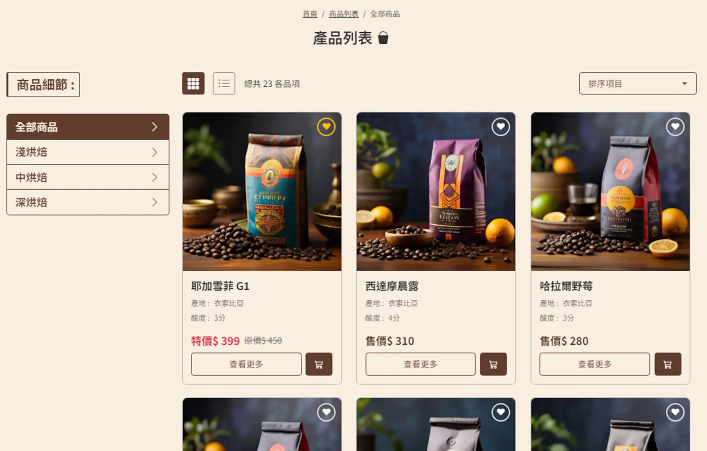
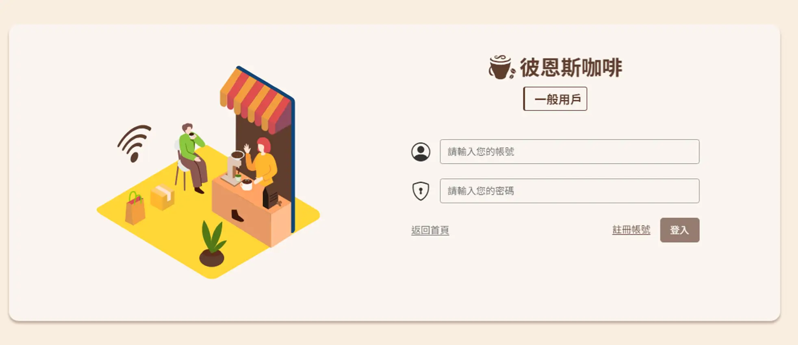

# Beans 彼恩斯咖啡網站

## 目錄📌

- [Beans 彼恩斯咖啡網站](#beans-彼恩斯咖啡網站)
  - [目錄📌](#目錄)
  - [作品描述✏️](#作品描述️)
    - [使用技術](#使用技術)
    - [發想說明](#發想說明)
  - [畫面說明🖼️](#畫面說明️)
    - [前台](#前台)
  - [安裝⬇️](#安裝️)
  - [使用套件🔧](#使用套件)
  - [問題與解決💡](#問題與解決)
  - [文件📝](#文件)
  - [其他🔗](#其他)

---

## 作品描述✏️

### 使用技術

     

- Vue3 & Vite : 使用 Composition API 開發，並透過 Vite 進行打包。
- Vue Router : 使用 Vue Router 進行路由管理。
- Pinia : 處理 Vue 應用程式狀態。
- Vee-Validate & Yup : 建構應用程式表單處理 ; 驗證欄位。
- Bootstrap 5 : 響應式頁面及各組件版型。
- Scss : 
- ESLint & Prettier : 管理撰寫風格，並格式化程式碼排版。

> Demo Website :
> - 前台連結 : https://neil10241126.github.io/Cafe-Website-Project/#/
> - 後台連結 :
> 
### 發想說明

自己本身喜歡品嘗手沖咖啡，因此想做一個咖啡網站專題，讓使用者可以透過網站來購買咖啡豆，並且可以將喜歡的咖啡加入收藏清單，參考相關網站資源來實踐電商購物。

平台開發使用 Vue3 搭配 VITE 來開發，使用 Bootstrap 5 建構響應式應用，用戶可自行選擇註冊，並提供商品瀏覽、加入購物車、結帳等功能。

**用戶端應該能夠 :**

- 瀏覽商品項目、並查看商品細節。
- 針對感興趣商品收藏、加入購物車並查看清單。
- 使用結帳流程，選擇付款方式並進行驗證。
- 使用登入註冊功能。

## 畫面說明🖼️

> 依序為首頁服務畫面、產品列表、登入

### 前台

## 安裝⬇️

> [!WARNING]  
> 請確認本機 node 環境至少 verson 16.14.0 以上 :

- 將專案下載至本機 : `git clone https://github.com/Neil10241126/Cafe-Website-Project.git`
- 移動至專案 : `cd Cafe-Website-Project`
- 安裝套件 : `npm install`
- 運行專案 : `npm run dev`
- 瀏覽器中開啟 : `http://localhost:3000`

## 使用套件🔧

- Node.js v18.15.0
- Vue.js v3.3.11
- Vite v5.0.10
- Vue Router v4.2.5
- Pinia v2.1.7
- Bootstrap v5.3.2
- Vee-Validate v4.13.1
- Yup v1.4.0
- Vue-Loading-Overlay v6.0.4
- Vue-Countup-V3 v1.4.2
- Aos v2.3.4
- SweetAlert2 v11.11.1
- Swiper v11.1.3

## 問題與解決💡

這裡記錄一些我目前開發這個項目時所遇到的狀況，裡面包含所遇到的問題，如何解決等。

- [商品影像讀取發生空白過渡](./notes/模糊影像佔位符.md)

## 文件📝

- 電商相關 API : [六角學院](https://www.hexschool.com/)
- 登入註冊、收藏 API : [Json Server Auth](https://github.com/jeremyben/json-server-auth)
- 圖片來源 : [unsplash](https://unsplash.com/)、[Leonardo.Ai](https://leonardo.ai/)

## 其他🔗

- 作品僅提供練習用途，不做授權使用。

