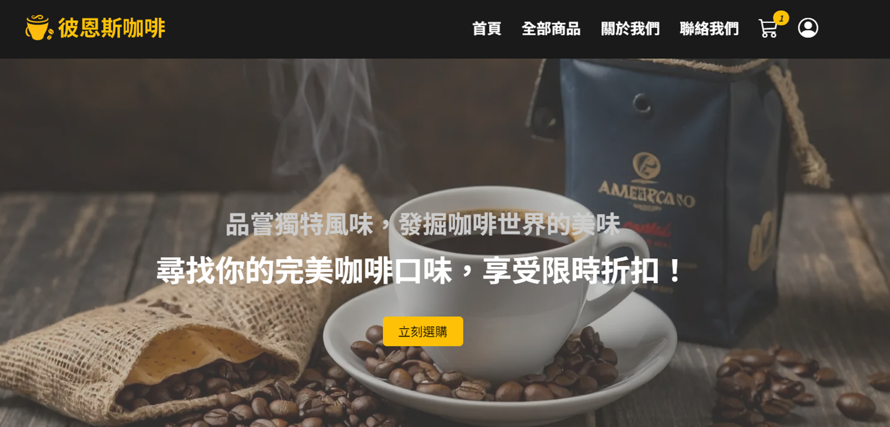
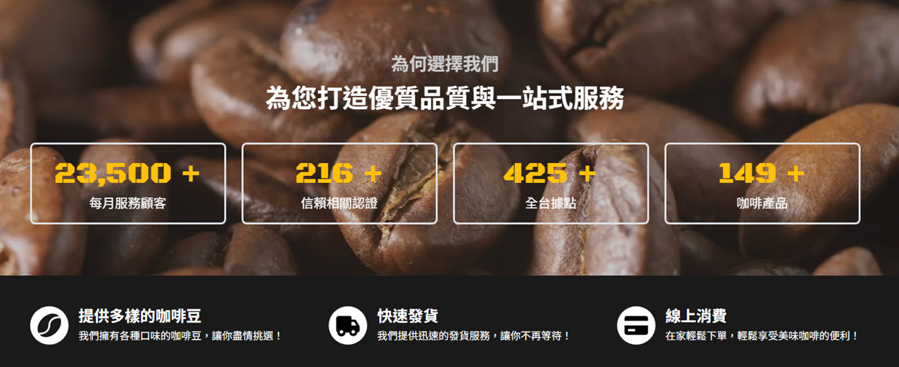
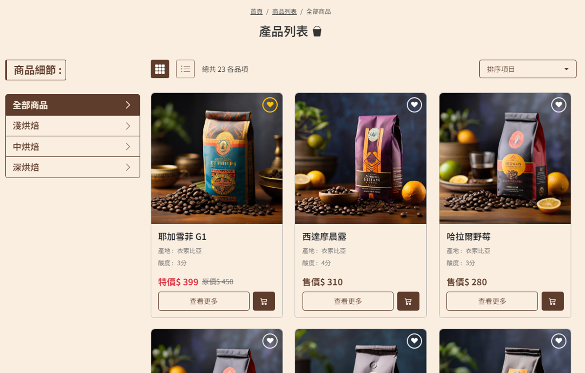
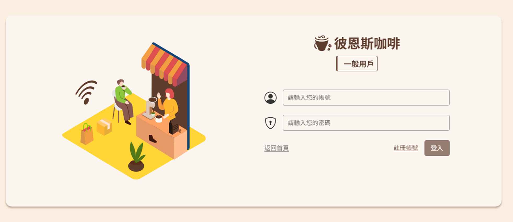

# Beans 彼恩斯咖啡網站

---

## 專案描述



自己本身喜歡品嘗手沖咖啡，因此想做一個咖啡網站專題，讓使用者可以透過網站來購買咖啡豆，並且可以將喜歡的咖啡加入收藏清單，參考相關網站資源來實踐電商購物。

平台開發使用 Vue3 搭配 VITE 來開發，使用 Bootstrap 5 建構響應式應用，用戶可自行選擇註冊，並提供商品瀏覽、加入購物車、結帳等功能。


## 主要技術

---
     

## Demo 連結
---

- [前台](https://neil10241126.github.io/Cafe-Website-Project/#/)

## 畫面介紹

---
> 依序為首頁服務畫面、產品列表、登入
> 







## 下載專案

---

> 按造流程下載並運行

### 引入專案

```bash
git clone https://github.com/Neil10241126/Cafe-Website-Project.git
```

### 移動至目錄

```bash
cd Front-Cafe-Websit
```

### 初始化套件

```bash
npm install
```

### 運行專案

```bash
npm run dev
```

## 運用技術

---

### 主要
- Node.js v18.15.0
- Vue.js v3.3.11
- Vite v5.0.10
- Vue Router v4.2.5
- Pinia v2.1.7
- Bootstrap v5.3.2
- Vee-Validate v4.13.1
- Yup v1.4.0

### 效果
- Vue-Loading-Overlay v6.0.4
- Vue-Countup-V3 v1.4.2
- Aos v2.3.4
- SweetAlert2 v11.11.1
- Swiper v11.1.3
  
## RESTful API

---

- `六角學院 - 電商 API` : 包含商品、購物車、結帳、優惠券功能。
- `Json Server Auth API` : 包含用戶端登入註冊、收藏功能。